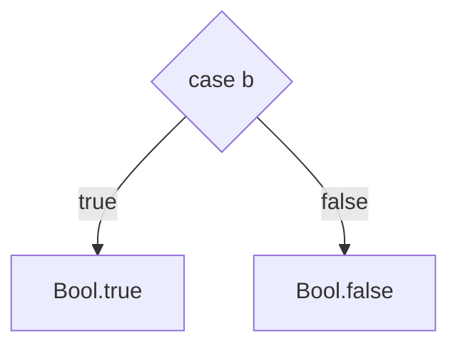

# Booleans

Kindelia Foundation 

<div class="pt-12">
  <span @click="$slidev.nav.next" class="px-2 py-1 rounded cursor-pointer" hover="bg-white bg-opacity-10">
    Pressione Espaço para passar
     <carbon:arrow-right class="inline"/>
  </span>
</div>

<div class="abs-br m-6 flex gap-2">
  <button @click="$slidev.nav.openInEditor()" title="Open in Editor" class="text-xl icon-btn opacity-50 !border-none !hover:text-white">
    <carbon:edit />
  </button>
  <a href="https://github.com/Kindelia/slides" target="_blank" alt="GitHub"
    class="text-xl icon-btn opacity-50 !border-none !hover:text-white">
    <carbon-logo-github />
  </a>
</div>

---

# Link

alguns links úteis:

[doc](https://app.gitbook.com/o/f5pmVKXE0zdcMOu6WXHf/s/MAbwOd8IAba3qXSYTi00/)


Todos os tipos estão em: [kind/base](https://github.com/Kindelia/Kind/tree/master/base)


---

# Hello Kind

Arquivo hello_kind.kind

```ts
hello: IO(Unit)
  IO { 
    IO.print("Hello, Kind!")
  }
  
hello_world: IO(Unit)
  hello
```

Executar o código
```ts
kind hello_kind --run
```

Saída:
```ts
Hello, Kind!
```


---

# Type Checker
É um verificador de syntaxe

O **type checker** é muito importante e um **ponto forte** do kind.

Ele checa se há algum erro de escrita no código.

```ts
kind hello_kind.kind
```

Saída:
```bash
hello: IO(Unit)
hello_world: IO(Unit)

All terms check.
```

Lembrem-se de usá-lo antes de executar o código.

---


# Dividindo o kind
Simplificadamente o kind pode ser dividido em:

* Tipos
* Funções
* Teoremas

O kind é uma linguagem de sistemas de **tipos** que você escreve **funções** e pode provar **teoremas**.

---

# Comentários
Comentários no código do kind

Para comentar algo usa-se `//`. 

Todo conteúdo da linha após `//`é desconsiderado.

```ts
hello: IO(Unit)
  IO { 
    IO.print("Hello, Kind!") // Um comentário
  }
  //Outro comentário
hello_world: IO(Unit)
  hello

// output: Hello, Kind!
```

---

# Types
Algebraic Data Types

**Types** é uma abreviação para **Algebric Data Types** (Haskell usa *Data*).

Basicamente, é como um conjunto matemático.

Ele é usado para agrupar e definir estruturas: 


```ts
type Cores {
  azul
  vermelho
  amarelo
}
```


No **kind** tudo possui um **tipo** e ele é **imutável**.

---

# Constructors
Data Constructors

**Construtores** são usados para **guarda informação**, porém podem não guardar nenhuma também, nesse caso, não chamados de **nulários**.

Diferentemente de variáveis que guardam valores, **os construtores são os responsáveis por gerarem os valores**.


Para representar o valor de um tipo, usa-se: `tipo.construtor`.

Por exemplo: `Cores.Azul`.


---

# Functions
Os tipos por si só, não possuem significado, servem apenas para serem usados nas funções.

As **funções** são as reponsáveis por darem **sentido** aos **tipos**.

### Declaração de uma função chamada **id**

```ts
id(a: Cores): Cores
```

Se não houver variaveis use 

```ts
id: Cores
```

Mas não

```ts
id(): Cores
```

---

# Tipo **Bool** E função identidade
Tipo **Bool** é um dos tipos mais simples


```ts
Type Bool {
    true
    false
}
```

A função identidade, simplesmente retorna o próprio valor de entrada: 

```ts {1|all}
id(a: Bool): Bool
case a {
  true: Bool.true
  false: Bool.false
  }
```

Nesta pequena função aplicamos 4 conceitos: **Função identidade**, **Tipo Bool**, **Construtores Bool.true** e **Bool.false**, e o **Comando Case**.

---

# Case
O **case** é um primitivo usado para construir funções.

O **case** é o principal responsável por realizar **pattern matching** dentro de **funções**.

Já o **pattern matching** é um mecanismo que identifica padrões, e apenas quando iguais, 
o código seguinte é executado.





---


# Goal

```ts
?goal
```


---

# Função identidade resumida 

---

# Exercícios

* Função Negação
* Função AND: 

| A   | B   | A AND B |
| --- | --- | --- |
| true | true | true |
| true | false | false |
| false | true | false |
| false | false | false |


