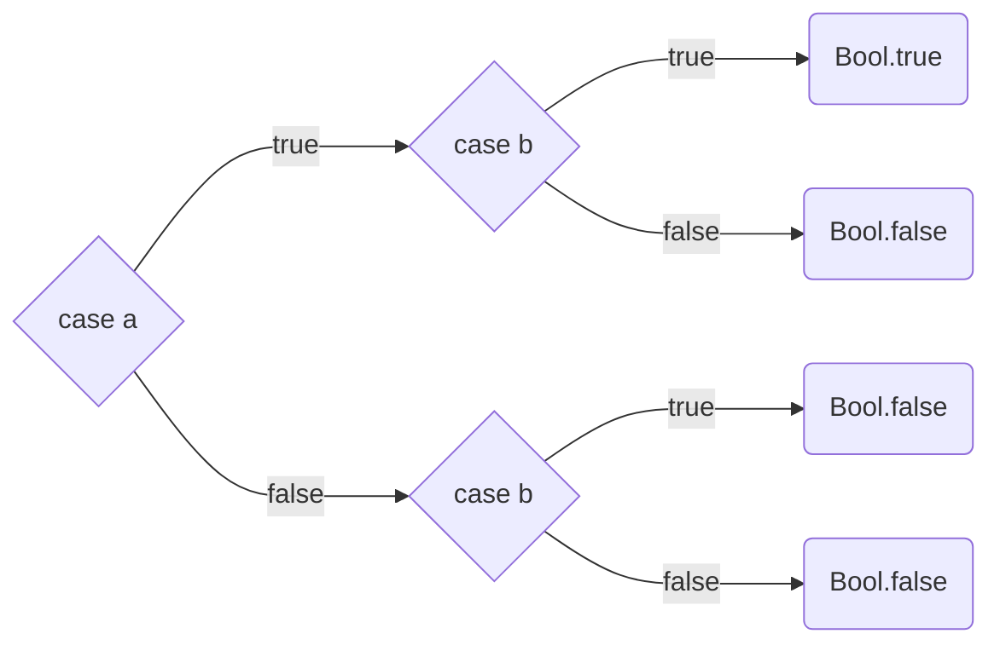

# Exercícios de Booleans

Kindelia Foundation 

<div class="pt-12">
  <span @click="$slidev.nav.next" class="px-2 py-1 rounded cursor-pointer" hover="bg-white bg-opacity-10">
    Pressione Espaço para passar
     <carbon:arrow-right class="inline"/>
  </span>
</div>

<div class="abs-br m-6 flex gap-2">
  <button @click="$slidev.nav.openInEditor()" title="Open in Editor" class="text-xl icon-btn opacity-50 !border-none !hover:text-white">
    <carbon:edit />
  </button>
  <a href="https://github.com/Kindelia/slides" target="_blank" alt="GitHub"
    class="text-xl icon-btn opacity-50 !border-none !hover:text-white">
    <carbon-logo-github />
  </a>
</div>


---
hideInToc: true
---

# Índice 

<Toc columns="2" />

---

# Função negação
Inverte o valor recebido

Sem muito mistério, a função negação é simplesmente o **oposto** da **função identidade**:

```ts {all}
id(a: Bool): Bool
case a {
  true: Bool.false
  false: Bool.true
  }
```

---

# Tabela Verdade do AND
Relembrando a tabela verdade 

| A   | B   | A AND B |
| --- | --- | --- |
| true | true | true |
| true | false | false |
| false | true | false |
| false | false | false |

---

# Árvore da Função AND
Para construir a função **AND** serão necessários 2 **cases**



---

# Função AND
Código para a função AND

```ts {1-6,9-12,14|1-6,13-14|1-2,7,13-14|1-2,8,13-14}
and(a: Bool, b: Bool): Bool
case a {
  true: case b {
    true: Bool.true
    false: Bool.false
  }
  true: id(b)
  true: b
  false: case b {
    true: Bool.false
    false: Bool.false
  }
  false: Bool.false
}
```

---


# Case A B
O case possui a opção de receber dois parâmetros

```ts {all}
and(a: Bool, b: Bool): Bool
case a b {
  true true: true
  true false: false
  false true: false
  false false: false
}
```

Deve-se ter cuidado com esta abordagem, e de preferência evitá-la, pois é fácil confundir-se em casos mais complicados.

---

# Opção Default
Reduzindo o código

Podemos simplificar mais o código, utilizando a opção default:

```ts {1-7|1-3,8}
and(a: Bool, b: Bool): Bool
case a b {
  true true: true
  true false: false
  false true: false
  false false: false
}
} default Bool.false
```

Desta forma para todas as entradas que não forem `true true`, ela retornará `Bool.false`.


